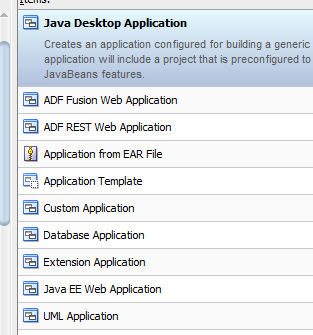

# ORACLE JDEVELOPER 12C
## Introducción

Oracle JDeveloper es un entorno de desarrollo integrado (IDE) gratuito y completo para la construcción de aplicaciones Java, Web y Mobile en la nube. JDeveloper ofrece un conjunto de herramientas de desarrollo de extremo a extremo para agilizar el desarrollo, la implementación y la administración de aplicaciones empresariales.

## Crear aplicaciones

Al momento de crear una aplicación en JDeveloper se debe tener en cuenta qué tipo de aplicación se va a crear, ya que JDeveloper soporta varios tipos de aplicaciones, entre ellos:

### 1. Java Desktop Application

**Descripción:** Crea una aplicación de escritorio Java genérica.  
**Uso:** Ideal para aplicaciones que se ejecutan en el escritorio y utilizan JavaBeans.
> [!NOTE]
>
> el javaBeans es un componente de software reutilizable que puede ser manipulado visualmente en un entorno de desarrollo.
> ejemplos de javaBeans son los controles de interfaz de usuario, como botones y barras de desplazamiento, y los componentes de acceso a datos, como las tablas y las consultas de bases de datos.

### 2. ADF Fusion Web Application

**Descripción:** Crea una aplicación web utilizando Oracle ADF (Application Development Framework).  
**Uso:** Perfecto para aplicaciones empresariales con interfaces web ricas.
> [!NOTE]
>
> Oracle ADF es un marco de desarrollo de aplicaciones basado en Java y Model-View-Controller (MVC) que simplifica el desarrollo de aplicaciones empresariales.

### 3. ADF REST Web Application

**Descripción:** Crea una aplicación web que expone servicios REST utilizando ADF.  
**Uso:** Útil para aplicaciones que necesitan proporcionar servicios RESTful.
[!NOTE]
>
> REST (Representational State Transfer) es un estilo de arquitectura de software que define un conjunto de restricciones para el diseño de servicios web.
> Los servicios RESTful son servicios web que siguen los principios de REST.

### 4. Application from EAR File

**Descripción:** Crea una aplicación a partir de un archivo EAR (Enterprise Archive).  
**Uso:** Facilita la importación y configuración de aplicaciones empresariales ya empaquetadas.
> [!NOTE]
>
> Un archivo EAR es un archivo de empaquetado de aplicaciones empresariales que contiene módulos de aplicaciones, como archivos WAR (Web Archive) y EJB (Enterprise JavaBeans).

### 5. Application Template

**Descripción:** Crea una aplicación basada en una plantilla predefinida.  
**Uso:** Útil para estandarizar la estructura de nuevas aplicaciones.

> [!NOTE]
>
> Una plantilla de aplicación es un patrón de diseño que define la estructura y configuración de una aplicación.

### 6. Custom Application

**Descripción:** Crea una aplicación personalizada según tus necesidades específicas.  
**Uso:** Ofrece flexibilidad para definir la estructura y configuración de la aplicación.

> [!NOTE]
>
> Una aplicación personalizada es una aplicación que se adapta a los requisitos y especificaciones del usuario.

### 7. Database Application

**Descripción:** Crea una aplicación que interactúa con bases de datos.  
**Uso:** Ideal para aplicaciones que necesitan realizar operaciones CRUD (Crear, Leer, Actualizar, Eliminar) en bases de datos.

### 8. Extension Application

**Descripción:** Crea una aplicación que extiende la funcionalidad de JDeveloper.  
**Uso:** Útil para desarrollar plugins o extensiones para JDeveloper.

> [!NOTE]
>
> Una extensión es un módulo de software que agrega nuevas funciones o características a una aplicación existente.

### 9. Java EE Web Application

**Descripción:** Crea una aplicación web utilizando Java EE (Enterprise Edition).  
**Uso:** Perfecto para aplicaciones empresariales que siguen los estándares Java EE.

> [!NOTE]
>
> Java EE es una plataforma de desarrollo de aplicaciones empresariales basada en Java que proporciona un conjunto de especificaciones y API para el desarrollo de aplicaciones web y empresariales.

### 10. UML Application

**Descripción:** Crea una aplicación basada en diagramas UML (Unified Modeling Language).  
**Uso:** Útil para modelar y diseñar la arquitectura de software.

> [!NOTE]
>
> UML es un lenguaje de modelado visual que se utiliza para representar y diseñar sistemas de software.