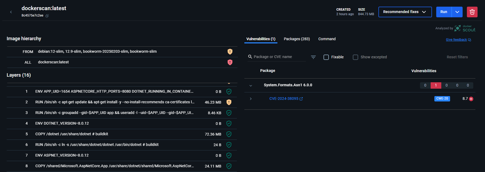
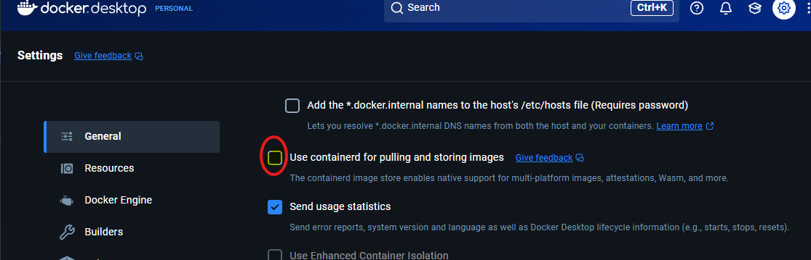

.# Docker avanzado

## Imagenes Multistage
Es una tecnica permite la construccion de imagenes optimizadas y eficientes en Docker, ya que permite la construccion de imagenes en multiples etapas, donde cada etapa se ejecuta en un contenedor diferente.

### Beneficios
- **Imagenes mas pequeñas**: Se pueden eliminar dependencias y archivos innecesarios en la imagen final

- **Imagenes mas seguras**: Se pueden separar las dependencias de desarrollo de las dependencias de produccion

- **Imagenes mas eficientes**: Se pueden optimizar las imagenes para que sean mas rapidas

### Ejemplo
``` Dockerfile
# Primera imagen para compilar 
FROM python:3.8.4-slim-buster as compile-image
# Se define una variable opcional
RUN python3 -m venv /opt/venv
# Se sobreescribe la variable path para que tenga prioridad los comandos del ambiente
ENV PATH="/opt/venv/bin:$PATH"
# Se copia unicamente el archivo de dependencias 
COPY requirements.txt /requirements.txt
# Se instalan las dependencias.
RUN pip install -r requirements.txt
# Listo, inicia el segundo contenedor 
FROM python:3.8.4-alpine3.12 AS build-image
# Se copia la carpeta venv que contiene todas las dependencias en el segundo contenedor
COPY --from=compile-image /opt/venv /opt/venv
# Se copia la aplicación
COPY . usr/src/app
# Se establece por defecto el directorio 
WORKDIR /usr/src/app
# Se agrega el directorio a las variables de ambiente.
ENV PATH="/opt/venv/bin:$PATH"
# Arranca la aplicación
ENTRYPOINT python3 main.py
```

**1 etapa o primer contendor**  

\- En esta etapa solo compila la imágen de python: instala dependencias y demás: El docker quedará sucio y pesado.

\- `FROM python:3.8.4-slim-buster as compile-image` la versión slim-buster te da la imagen que compila con C. Por lo que es adecuada para correr numpy, keras y todo lo relacionado con machine learning.  

\- la línea `RUN python3 -m venv /opt/venv` asigna una carpeta para el entorno virtual.  

\- la línea `ENV PATH="/opt/venv/bin:$PATH"` asigna el entorno virtual a las variables de entorno de linux 🤯  (así todo corre en el entorno virtual y no en el sistema operativo del docker)  

\- las dependencias se instalarán en el entorno virtual: `RUN pip install -r requirements.txt` &#x20;


**2 etapa o segundo contendor** &#x20;

\- La primera etapa deja el docker lleno de caché y basura que solo hace el docker más pesado. Por lo que en esta segunda etapa, se crea un nuevo docker que sí va a ser usado.  

\- `FROM python:3.8.4-alpine3.12 AS build-image` descarga la imágen de python que funciona con alpine. *¡Alpine es la distro de linux más liviana que existe! 🪶*  

\- la línea `COPY --from=compile-image /opt/venv /opt/venv` copia las dependencias del contenedor sucio y las pega en el directorio opt/venv (ya sabes el entorno virtual) &#x20;

\- aquí **SÍ** copias el proyecto de tu vsc local `COPY . usr/src/app`, en un contenedor limpio. Para que todo dev siempre sepa dónde buscar el proyecto, déjalo en usr/src/app. <u>Así millones de devs te lo agradecerán</u> &#x20;

\- Creas el Workdir, nuevamente asignas el path para que todas las dependencias se instalen allí y ENTRYPOINT arranca el archivo que necesites.

## Docker scan
Es una herramienta de seguridad que permite analizar las imagenes de Docker en busca de vulnerabilidades.

<center>  </center>

este nos da un reporte donde nos indica las vulnerabilidades que tiene la imagen, el nivel de severidad y la descripción de la vulnerabilidad.

## Compilacion multiplataforma

Docker permite la compilacion de imagenes para diferentes arquitecturas, esto se logra con la bandera `--platform` al momento de construir la imagen.

```bash
docker build --platform linux/amd64,linux/arm64 -t myapp:latest .
```
- `**linux/amd64**`: cualquier laptop o pc con procesador de 64 bits
- `**linux/arm64**`:para sistemas embebidos como raspberry pi que es un sistema de 64 bits que se usa para proyectos de IoT

Para habilitar el uso de contairner para
 

- su tiempo de creacion es mas tardado que una imagen normal debido a que estamos desplegando dos imagenes en una sola.


